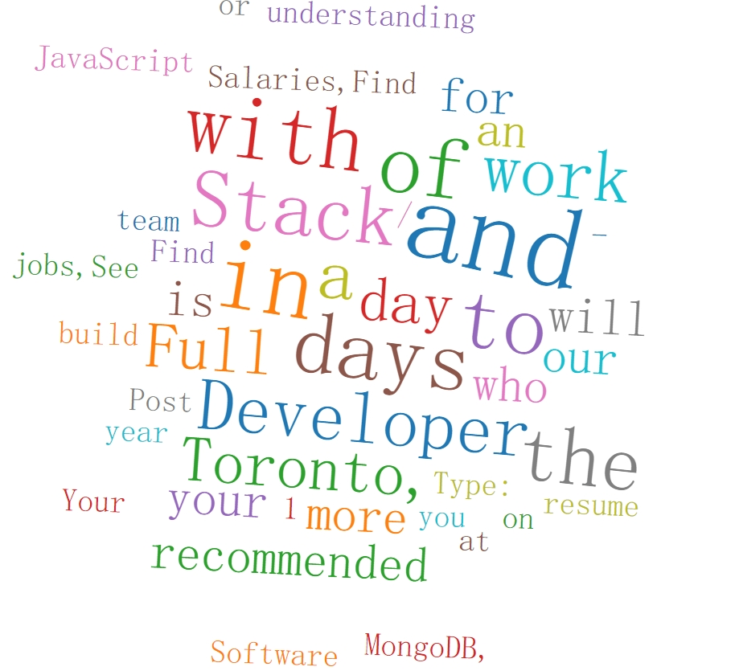

# wordcloud

1. Use Axios and cheerio for web scraping

2. Use WordFrequenter to split string and count words

3. Use React.js for front-end and react-d3-cloud for visualization.

4. Use Node.js for back-end.


<div  align="center">
</b>
</div>

### Installing

Clone the repo

```
git clone https://github.com/moonfallmaple/wordcloud.git
```

Change into the *wordcloud* project directory

```
cd wordcloud/backend
```
Install project dependencies，then start the server

```
nodemon index.js
```
then
```
cd wordcloud/frontend

```
Install project dependencies，then start the application

```
npm start
```

The app will automatically launch in your localhost:3000 port.

